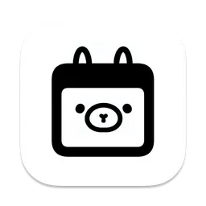

# NotesOllama

Use [Ollama](https://ollama.com) to talk to local LLMs in Apple Notes. Inspired by [Obsidian Ollama](https://github.com/hinterdupfinger/obsidian-ollama). Why should Obsidian have all the nice plugins?

## Demo

<video width="800" src="https://github.com/andersrex/notesollama/assets/1891619/d289d5b3-1e30-4aa3-a34a-fd2a6fa888d0"></video>

## Stack

- SwiftUI for user interface
- [AXSwift](https://github.com/tmandry/AXSwift) to access Notes through macOS's accessibility API
- [OllamaKit](https://github.com/kevinhermawan/OllamaKit) to interface with Ollama

## Usage

Open the project in Xcode to run, or download the binary [here](https://smallest.app/notesollama).

NotesOllama assumes you have Ollama running on the default macOS port (http://localhost:11434). If you are running Ollama on a different host or port, you need to set the value of the Ollama endpoint in the environment variable `NOTESOLLAMA_OLLAMA_BASE_URL`.

## Custom Prompts

You can change the default prompts by editing the commands.json file inside the NotesOllama executable and restarting from the magic wand menu.

Right click the NotesOllama executable in Finder and select "Show Package Contents" and open `Contents/Resources/commands.json` in a text editor.

Or use vim: `$ vim NotesOllama.app/Contents/Resources/commands.json`

## Support

If you'd like to support the development of NotesOllama, check out my other plugin [NotesCmdr](https://smallest.app/notescmdr). I think it's even cooler!

## License

MIT License

Copyright (c) 2024 Anders Rex
